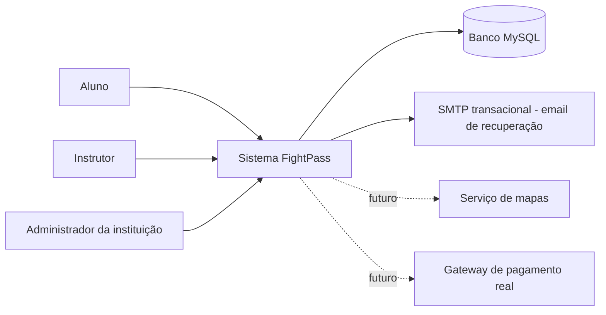
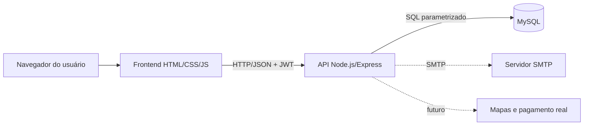

# Atualização para o TCC.docx - Entrega 3

Texto pronto para inserção no documento em formato ABNT, mantendo a numeração e a formatação adotadas no arquivo principal.

## 1. Atualização dos requisitos funcionais

Os requisitos funcionais do sistema FightPass foram atualizados para refletir a integração entre frontend, backend e banco de dados. O sistema passa a disponibilizar autenticação com cadastro, login, recuperação e redefinição de senha, utilizando token JWT para manutenção da sessão do usuário. As telas internas exigem autenticação e apresentam menus compatíveis com o perfil do usuário autenticado.

O cadastro de aluno foi complementado com validação de CPF e liberação automática de um plano de teste de 1 dia, limitado a uma utilização por CPF. Essa alteração permite que o aluno acesse a plataforma inicialmente sem contratar um plano definitivo, mantendo o controle de uso por documento.

Foi incluído o requisito funcional de contratação demonstrativa de planos FightPass. O sistema apresenta os planos Plano Avulso, Plano Intermediário e Plano FightPass Total, permite simular cobrança por Pix ou boleto e ativa o acesso do aluno após confirmação fictícia do pagamento. O fluxo possui finalidade acadêmica e não executa cobrança real.

O requisito de busca de academias foi ampliado para permitir consulta de modalidades, instituições e detalhes da instituição por meio da API. A tela de mapa apresenta lista de instituições, filtros por modalidade e detalhamento de turmas vinculadas, utilizando dados persistidos no banco MySQL.

O requisito de agendamento foi consolidado com criação de agendamento simples e recorrente para alunos. O backend valida duplicidade, capacidade da turma, data passada, compatibilidade entre data e dia da semana do horário e limite de cancelamento. Em agendamentos recorrentes, a API verifica todos os conflitos antes da gravação, evitando criação parcial inconsistente.

O requisito de check-in foi implementado com geração de token associado a agendamento válido, tempo de expiração configurável, bloqueio de reutilização e registro de presença. A tela exibe QR Code, contagem regressiva e botão de confirmação para demonstração do fluxo.

O requisito de avaliação de alunos foi implementado para instrutores e administradores vinculados à instituição. O sistema permite listar alunos, visualizar perfil acadêmico, consultar histórico de avaliações e registrar nota de 0 a 10 com comentário. O backend valida se o aluno pertence à instituição do avaliador.

Os dashboards do aluno e da instituição foram integrados à API. O painel do aluno apresenta aulas agendadas, taxa de presença e média de avaliação. O painel institucional apresenta alunos ativos, frequência média e percentual de risco de evasão com base nos dados armazenados.

## 2. Atualização dos requisitos não funcionais

A Entrega 3 reforçou o requisito não funcional de segurança por meio de autenticação JWT, hash de senha com `bcryptjs`, validação de entradas com `express-validator`, controle de acesso por perfil e proteção de rotas no frontend. As mensagens de autenticação permanecem genéricas em operações sensíveis, reduzindo exposição de dados.

O requisito de persistência foi atendido com uso de banco MySQL e consultas parametrizadas nos principais fluxos. As tabelas de usuários, instituições, modalidades, assinatura demonstrativa da instituição na plataforma, planos de acesso, passes de alunos, uso de teste por CPF, simulações de pagamento, turmas, agendamentos, tokens de presença, presenças, avaliações, progresso e auditoria sustentam as funcionalidades demonstráveis.

O requisito de manutenibilidade foi preservado pela organização modular do backend em rotas por domínio e pela criação de uma camada comum de API no frontend. Essa separação reduz duplicação de código, padroniza tratamento de erros e facilita evolução posterior.

O fluxo de recuperação registra token, mantém resposta genérica e envia email por meio de SMTP quando `SMTP_USER` e `SMTP_PASS` estão configurados. Sem as credenciais SMTP, o token permanece salvo no banco para testes locais. O mapa também permanece demonstrativo, sem integração com serviço externo de geolocalização em tempo real. O fluxo financeiro foi implementado como protótipo, com geração de QR Code Pix e código de boleto fictícios, sem integração com gateway bancário.

## 3. Atualização das regras de negócio

As regras de negócio foram complementadas para a segunda parte da aplicação. O cadastro aceita perfis de aluno, instrutor e administrador da instituição. Administradores podem criar instituição no cadastro, enquanto instrutores e alunos são usuários do sistema. Para fins de demonstração institucional, o seed fornece usuários já vinculados à instituição Dojo Sakura.

Para alunos, o cadastro exige CPF válido e registra a utilização do teste gratuito na tabela de controle de CPF. O plano de teste dura 1 dia, concede 1 treino e não pode ser emitido novamente para o mesmo CPF. Quando não existe teste ou plano ativo com treinos disponíveis, o backend bloqueia novos agendamentos e retorna mensagem orientando a contratação de plano.

Os planos pagos foram modelados como planos fictícios de acesso: Plano Avulso, com direito a 1 luta ou treino; Plano Intermediário, com direito a 3 lutas ou treinos; e Plano FightPass Total, com acesso livre aos treinos disponíveis durante o período do plano. A contratação por Pix ou boleto é registrada como simulação e a confirmação fictícia ativa o passe do aluno. Nenhuma cobrança real é realizada.

As instituições cadastradas por administradores ficam vinculadas ao FightPass por meio de assinatura demonstrativa mensal. O vínculo é persistido para representar o modelo de negócio no qual academias, dojos e centros de treino participam da plataforma mediante mensalidade fixa.

O agendamento de aulas por aluno passou a obedecer às seguintes regras: não permitir agendamento duplicado para mesmo aluno, horário e data; bloquear turma sem vagas; impedir data passada; validar se a data escolhida corresponde ao dia da semana do horário; respeitar limite de cancelamento definido em `BOOKING_CANCELLATION_LIMIT_HOURS`; e, no agendamento recorrente, validar todos os conflitos antes de gravar registros.

O check-in passou a obedecer às seguintes regras: token vinculado a agendamento válido; expiração definida por `CHECKIN_TOKEN_TTL_SECONDS`; impedimento de token vencido ou reutilizado; bloqueio de presença duplicada; registro de presença; e atualização do agendamento para confirmado quando aplicável.

As avaliações obedecem à regra de vínculo institucional. Instrutores e administradores somente podem acessar e avaliar alunos vinculados à mesma instituição. A nota é validada no intervalo de 0 a 10.

As ações relevantes, como cadastro, login, alteração de perfil, simulação e confirmação de pagamento fictício, criação e cancelamento de agendamento, geração e confirmação de check-in e avaliação, são registradas em auditoria simples na tabela `audit_logs`.

## 4. Quadro de histórico de alterações

Quadro X - Histórico de alterações dos requisitos e regras de negócio

| Código | Tipo | Descrição anterior | Alteração realizada na Entrega 3 | Justificativa | Impacto nas telas/backend | Status |
|---|---|---|---|---|---|---|
| RF01 | Requisito funcional | Login e cadastro previstos no protótipo. | Integração com API de cadastro, login, sessão JWT e `GET /api/auth/me`. | Permitir acesso real ao sistema. | `login.html`, `cadastro.html`, `layout.js`, rotas `auth`. | Implementado |
| RF02 | Requisito funcional | Busca de academias apresentada com dados fixos. | Consulta de modalidades, instituições e detalhes pela API. | Exibir dados persistidos no banco. | `mapa.html`, rotas de catálogo. | Implementado |
| RF03 | Requisito funcional | Agendamento visual sem persistência. | Agendamento simples e recorrente com validações no backend. | Demonstrar regras de negócio centrais. | `agendar.html`, `minhas-aulas.html`, rotas `bookings`. | Implementado |
| RF04 | Requisito funcional | Check-in simulado por QR fixo. | Token real, expiração, confirmação e presença persistida. | Comprovar fluxo de presença. | `checkin.html`, rotas `checkin`. | Implementado |
| RF05 | Requisito funcional | Avaliação representada por telas estáticas. | Listagem de alunos, perfil, histórico e registro de nota. | Apoiar acompanhamento técnico. | `gestao.html`, `perfil-aluno.html`, `avaliar-aluno.html`, rotas `evaluations`. | Implementado |
| RF06 | Requisito funcional | Dashboard com números fixos. | Indicadores calculados por consultas ao banco. | Tornar a demonstração verificável. | `dashboard.html`, `gestao.html`, rotas `dashboard`. | Implementado |
| RF07 | Requisito funcional | Cadastro de aluno pressupunha uso sem plano explícito. | Cadastro valida CPF e libera teste gratuito de 1 dia, limitado por CPF. | Permitir entrada inicial sem contrato definitivo. | `cadastro.html`, rota `auth`, tabelas `student_access_passes` e `student_trial_uses`. | Implementado |
| RF08 | Requisito funcional | Não havia tela de contratação de planos. | Tela de planos com simulação de Pix e boleto fictícios. | Representar fluxo financeiro do protótipo. | `planos.html`, rotas `access`, tabela `payment_simulations`. | Implementado |
| RN01 | Regra de negócio | Capacidade da turma não validada. | Bloqueio de agendamento quando a capacidade é atingida. | Evitar superlotação. | Backend `bookings`. | Implementado |
| RN02 | Regra de negócio | Duplicidade não validada. | Bloqueio por aluno, horário e data. | Evitar reservas repetidas. | Backend `bookings`. | Implementado |
| RN03 | Regra de negócio | Cancelamento sem limite. | Aplicação de limite por `BOOKING_CANCELLATION_LIMIT_HOURS`. | Proteger operação da instituição. | `minhas-aulas.html`, backend `bookings`. | Implementado |
| RN04 | Regra de negócio | Permissões apenas conceituais. | Controle por perfil e vínculo institucional. | Impedir acesso indevido a dados. | `layout.js`, rotas protegidas. | Implementado |
| RN05 | Regra de negócio | Teste gratuito não controlado. | Teste único por CPF, com 1 dia de duração e 1 treino. | Evitar reutilização indevida do benefício. | Backend `auth` e `access`. | Implementado |
| RN06 | Regra de negócio | Agendamento não dependia de plano. | Aluno sem plano ativo ou sem treinos disponíveis não consegue agendar. | Aproximar o fluxo do modelo de assinatura. | Backend `bookings`, tela `planos.html`. | Implementado |
| RN07 | Regra de negócio | Instituições não possuíam vínculo financeiro com a plataforma. | Cadastro de administrador cria assinatura demonstrativa mensal da instituição. | Representar o modelo de negócio proposto. | Backend `auth`, tabela `institution_platform_subscriptions`. | Implementado |
| RNF01 | Requisito não funcional | Segurança prevista documentalmente. | JWT, hash de senha, validação e mensagens genéricas. | Reduzir riscos básicos de autenticação. | Backend e frontend. | Implementado |
| RNF02 | Requisito não funcional | Persistência planejada. | Dados reais em MySQL e seeds de demonstração. | Viabilizar conferência no GitHub Classroom. | Banco, API e telas integradas. | Implementado |
| RNF03 | Requisito não funcional | Pagamento real não definido. | Simulação financeira explícita, sem cobrança real. | Permitir demonstração sem depender de gateway bancário. | `planos.html`, rotas `payments`. | Implementado como protótipo |

## 5. Seção 3.8 Arquitetura do sistema com C4

Substituir o subtítulo anterior "3.8 Infraestrutura da Aplicação" por "3.8 Arquitetura do sistema".

### 3.8 Arquitetura do sistema

A arquitetura do FightPass foi organizada com separação entre interface, API e persistência. A interface foi desenvolvida com HTML, CSS e JavaScript estáticos, enquanto o backend foi implementado em Node.js com Express. A comunicação ocorre por API REST, utilizando JSON como formato de troca de dados. A persistência é realizada em banco MySQL, e as configurações sensíveis são externalizadas por variáveis de ambiente.

No modelo C4, o nível C1 descreve o contexto do sistema. Os usuários principais são aluno, instrutor e administrador da instituição. O sistema FightPass centraliza autenticação, busca de instituições, planos de acesso, simulação financeira, agendamento, check-in, avaliações e dashboards. O banco MySQL armazena os dados de negócio. O envio de email de recuperação utiliza SMTP quando configurado. Serviços externos futuros, como mapa real e gateway de pagamento, poderão ser integrados posteriormente.

Diagrama C1 - Contexto do sistema

No nível C2, o sistema é dividido em quatro containers principais: navegador do usuário, frontend estático, API Node.js/Express e banco MySQL. O navegador executa as páginas HTML, CSS e JavaScript, armazena temporariamente o token JWT e realiza chamadas HTTP para a API. A API concentra regras de negócio, validações, autenticação, simulação de pagamento e acesso ao banco. O MySQL mantém dados persistentes da aplicação.

Diagrama C2 - Containers

A separação entre frontend e backend foi adotada para permitir evolução independente da interface e da lógica de negócio. A API REST foi escolhida por simplicidade, compatibilidade com aplicações web e facilidade de demonstração. O JWT foi utilizado para autenticação sem estado no servidor. O MySQL foi adotado por sua aderência ao modelo relacional das entidades do domínio, como usuários, instituições, planos, passes de acesso, pagamentos fictícios, turmas, agendamentos, presenças e avaliações. As variáveis de ambiente permitem parametrizar porta, conexão com banco, segredo JWT, tempo de token de check-in, limite de cancelamento e SMTP. A modularização por domínio melhora legibilidade e manutenção.

## 6. Atualização da seção de desenvolvimento da aplicação

Na Entrega 3, o desenvolvimento da aplicação concentrou-se na integração entre frontend, backend e persistência. Foi criada uma camada comum de API no frontend, responsável por definir a URL base, enviar token JWT, tratar respostas JSON, padronizar erros e armazenar sessão no `localStorage`.

As telas principais foram integradas aos endpoints existentes. O login autentica o usuário e redireciona conforme perfil. O cadastro cria usuários, valida CPF de aluno, libera teste gratuito de 1 dia e, quando o perfil é administrador da instituição, também cria a instituição e seu vínculo demonstrativo com a plataforma. A recuperação de senha consome endpoint próprio, mantém resposta genérica e pode enviar email real por SMTP. O dashboard apresenta indicadores reais e mostra a situação do acesso FightPass do aluno. A tela de planos exibe planos fictícios, gera Pix ou boleto demonstrativo e ativa o plano após confirmação fictícia. O mapa lista modalidades e instituições. O agendamento cria reservas simples ou recorrentes apenas quando o aluno possui acesso ativo. A tela de minhas aulas lista e cancela agendamentos. O check-in gera token, exibe QR Code e confirma presença. O perfil permite atualização de dados e alteração de senha. A gestão institucional lista alunos e indicadores. O perfil do aluno mostra avaliações e progresso. A avaliação registra nota e comentário.

As regras demonstráveis foram implementadas no backend para não dependerem apenas da interface. O sistema valida permissões por perfil, vínculo institucional, CPF do aluno, uso único do teste por CPF, acesso ativo antes do agendamento, capacidade da turma, duplicidade de agendamento, data passada, compatibilidade entre data e dia da semana, limite de cancelamento, expiração de check-in, reutilização de token, presença duplicada e nota entre 0 e 10.

A persistência é realizada em MySQL. Os scripts de migration e seed criam a estrutura e dados de demonstração. Os usuários de demonstração utilizam a senha `FightPass123`, com perfis de administrador, instrutor e aluno vinculados à Dojo Sakura.

Quanto à segurança, a aplicação utiliza hash de senha, JWT, validações de entrada, controle de acesso por perfil, mensagens genéricas em operações sensíveis e envio de recuperação por provedor transacional configurável. Como limitação, o mapa ainda é demonstrativo e não utiliza serviço externo de geolocalização; o pagamento é apenas uma simulação acadêmica, sem comunicação com banco, Pix real, boleto real ou gateway financeiro; e o cadastro de instrutor cria a conta, mas o vínculo operacional com uma instituição ainda depende de registro no banco ou funcionalidade administrativa futura.

## 7. Roteiro de demonstração para o professor

1. Executar `npm run migrate` e `npm run seed` no backend, com MySQL configurado.
2. Executar a API com `npm run dev` ou `npm start`.
3. Abrir `fightpass-frontend/index.html` e acessar a tela de login.
4. Entrar como aluno com `joao@fightpass.com` e senha `FightPass123`.
5. Acessar o dashboard do aluno e conferir aulas, presença e média de avaliação.
6. Abrir a tela de planos, simular contratação por Pix, observar o QR Code fictício e confirmar o pagamento demonstrativo.
7. Repetir a simulação com boleto para observar o código fictício e a mensagem de protótipo.
8. Abrir o mapa, filtrar por modalidade e selecionar a Dojo Sakura para visualizar detalhes e turmas.
9. Acessar agendamento, criar uma aula simples e repetir a operação para demonstrar bloqueio de duplicidade.
10. Criar um agendamento recorrente e, se houver conflito, observar a mensagem consolidada.
11. Para demonstrar bloqueio por falta de plano, utilizar um aluno sem acesso ativo ou expirar seu passe no banco e tentar agendar novamente.
12. Abrir minhas aulas e testar cancelamento, observando a regra de limite de horas.
13. Abrir check-in, gerar token/QR, confirmar presença e tentar reutilizar o mesmo token para demonstrar bloqueio.
14. Sair e entrar como administrador com `contato@dojosakura.com` e senha `FightPass123`.
15. Abrir gestão institucional para conferir alunos ativos, frequência e risco de evasão.
16. Abrir perfil do aluno e visualizar progresso e histórico de avaliações.
17. Registrar nova avaliação para o aluno e retornar ao perfil para validar o histórico.
